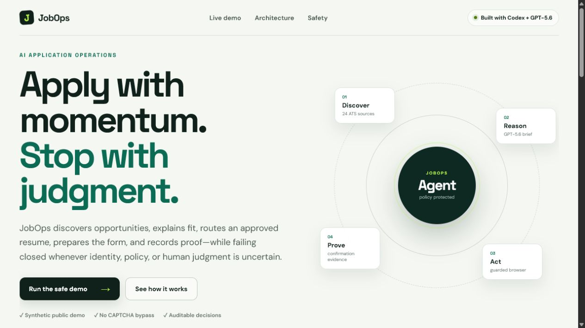
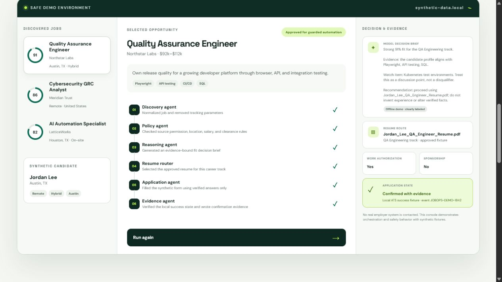
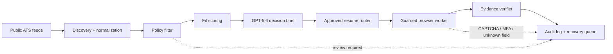

# JobOps

[](https://github.com/IKImranKhanIK/jobops/actions/workflows/verify.yml)
[](LICENSE)


**Apply with momentum. Stop with judgment.**



JobOps is a local-first, auditable job-application operations agent. It discovers roles, explains fit, routes an approved resume, prepares verified answers, and records confirmation evidence. When a required answer, identity check, source policy, CAPTCHA, MFA prompt, assessment, or final state is uncertain, it fails closed and explains why.

This repository is the public-safe OpenAI Build Week showcase. It contains only synthetic jobs and candidate data. It never connects to a real employer during the demo.

## Why it exists

Job searching is not one task. It is a long-running operations problem spread across discovery, filtering, research, resume selection, repetitive forms, follow-up, and record keeping. Existing automation often optimizes only for volume. JobOps instead optimizes for **traceable decisions and recoverable execution**.

## Interactive demo

The showcase demonstrates one complete synthetic workflow:

1. Select a discovered job.
2. Check location, salary, clearance, and source permissions.
3. Generate an evidence-bound fit brief with GPT‑5.6.
4. Route the approved resume for the detected career track.
5. Fill a local synthetic form using verified answers.
6. Confirm success only after evidence exists.

When `OPENAI_API_KEY` is absent, the model brief is replaced by an explicitly labeled deterministic offline response. The interface never pretends fallback content came from OpenAI.



The repository also includes a narrated 55-second [MP4 demo](public/jobops-demo.mp4) and [WebVTT captions](public/jobops-demo.vtt).

## Run locally

Requirements: Node.js 20 or newer.

```bash
npm install
copy .env.example .env.local
npm run dev
```

Open [http://localhost:3000](http://localhost:3000).

To enable the live decision brief, place an API key in `.env.local`:

```env
OPENAI_API_KEY=your-key
OPENAI_MODEL=gpt-5.6
```

The integration uses the OpenAI Responses API. OpenAI recommends GPT‑5.6 as its flagship model for complex reasoning and coding, and current models are available through the Responses API. See the [OpenAI model guide](https://developers.openai.com/api/docs/models) and [text generation guide](https://developers.openai.com/api/docs/guides/text).

## Verify

```bash
npm run verify
```

This runs policy tests, deterministic fallback tests, a repository privacy scan, and a production Next.js build.

## Regenerate the demo video

The recording script uses installed Chrome, Playwright video capture, Windows local speech synthesis, and FFmpeg:

```powershell
npx playwright install ffmpeg
winget install --id Gyan.FFmpeg --exact
npm run build
npm run start -- -p 3100
# In a second terminal:
npm run demo:record
```

For a competition recording, configure `OPENAI_API_KEY` first so the on-screen provider badge displays the actual GPT‑5.6 model rather than the honest offline fallback.

## Safety model

- **Verified facts only:** no invented experience, credentials, dates, skills, or demographic answers.
- **Explicit source modes:** each source is `automatic`, `review_first`, or `discovery_only`.
- **Fail closed:** unknown sources and unknown required fields stop for review.
- **Protected controls:** CAPTCHA and MFA are never bypassed.
- **Evidence before success:** a Submit click is not a confirmed application.
- **Human control:** pause, emergency stop, retry, and skip remain available.
- **Synthetic public demo:** no personal applicant records, resumes, browser profiles, or real job URLs are included.

Read the full [safety and privacy model](docs/SAFETY_AND_PRIVACY.md).

## Architecture



The private prototype uses Windows for the dashboard, API, browser automation, and local models, with PostgreSQL isolated behind a private network tunnel. The public repository represents that architecture with safe synthetic fixtures. See [architecture details](docs/ARCHITECTURE.md).

## Validated prototype results

The private prototype's July 2026 A-to-Z QA run reported:

- 5,450 listings examined across 24 public ATS sources in one discovery run.
- 16 of 16 read-only API surfaces healthy.
- 10 applications confirmed with browser or email evidence.
- Explicit protection for discovery-only and review-first sources.

These numbers are historical validation evidence, not claims that this public synthetic demo submits real applications. See [validation notes](docs/VALIDATION.md).

## Built with

- Codex for repository analysis, implementation, regression testing, debugging, and submission packaging.
- GPT‑5.6 through the OpenAI Responses API for evidence-bound decision briefs.
- Next.js 15 and React 19 for the interactive showcase.
- Node's test runner for policy and fallback regression tests.

JobOps was prepared for the [OpenAI Build Week Challenge](https://openai.com/build-week/), which evaluates technical implementation, design and user experience, potential impact, idea quality, and thoughtful use of GPT‑5.6 and Codex.

## Submission materials

- [Devpost submission copy](docs/DEVPOST_SUBMISSION.md)
- [Demo video script](docs/DEMO_VIDEO_SCRIPT.md)
- [Architecture](docs/ARCHITECTURE.md)
- [Safety and privacy](docs/SAFETY_AND_PRIVACY.md)
- [Validation](docs/VALIDATION.md)
- [Codex build log](docs/CODEX_BUILD_LOG.md)
- [Release checklist](docs/RELEASE_CHECKLIST.md)
- [Current submission status](docs/SUBMISSION_STATUS.md)

## License

MIT. See [LICENSE](LICENSE).
