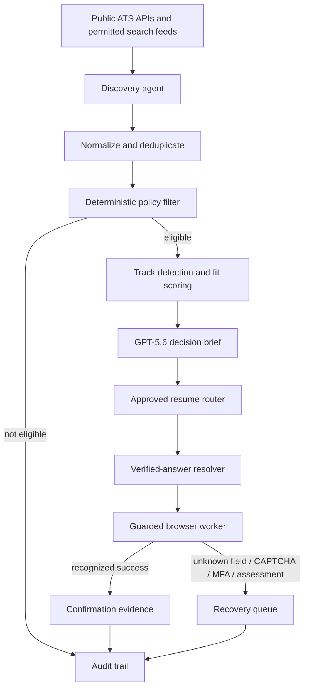
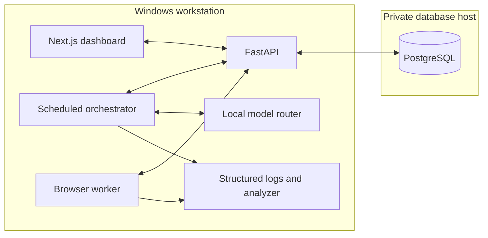
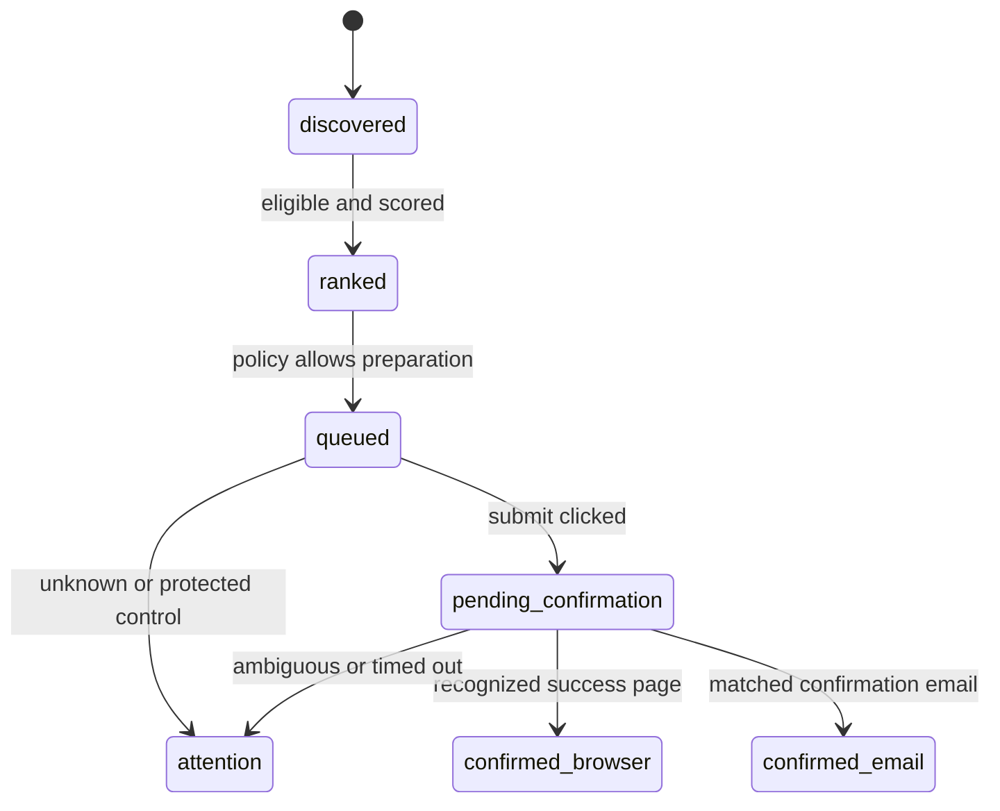

# Architecture

## Responsibility map

## Public showcase

The standalone showcase is intentionally small and safe:

- Next.js renders the interactive operations console.
- Synthetic fixtures model the applicant, resumes, jobs, and verified answers.
- `lib/policy.js` owns source permissions and submission invariants.
- `POST /api/brief` calls the OpenAI Responses API.
- GPT‑5.6 receives only the selected synthetic job and a non-fabrication rule.
- When no API key exists, a deterministic local brief is returned with an explicit disclosure.
- No database, real resume, job board account, or employer endpoint is required.

## Private prototype

The validated private prototype has a larger operational architecture:

Windows owns application compute, browser control, scheduled work, documents, and local inference. PostgreSQL is isolated behind a private tunnel. The architecture does not require public hosting or shared browser credentials.

## Why the model is not the policy engine

Permissions must be inspectable and stable. The model therefore cannot decide whether a source is allowed, whether a resume hash is approved, whether a required field is complete, or whether a success page counts as confirmation. GPT‑5.6 is used where language understanding adds value: compressing evidence into a clear decision brief and surfacing a watch item.

## Evidence states

The central invariant is that `submit clicked` and `application confirmed` are different states.
